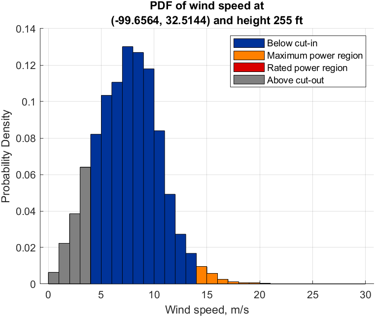

# Wind Turbine Capacity Factor Analysis
### Post Oak Wind LLC - Abilene, TX | Gamesa G87-2.0 | MATLAB

MATLAB analysis of the **Post Oak Wind LLC** wind power plant (Plant ID: 56483), located near Abilene, Texas (−99.6564°, 32.5144°). The study covers capacity factor estimation, wind speed statistics, and a rated power uprating analysis using hourly wind data from 2019.

---

## Repository Structure

| File / Folder | Description |
|---------------|-------------|
| `eia8602023/` | EIA Form 860 source data (plant location & turbine specs) |
| `f923_2019/` | EIA Form 923 source data (observed generation, 2019) |
| `Gamesa G87 2MW.pdf` | Turbine technical datasheet (Gamesa G87-2.0) |
| `main.mlx` | MATLAB Live Script with all calculations and plots |
| `Report.pdf` | PDF report exported from the Live Script |
| `Wind Data.csv` | Hourly wind speed data for 2019 at hub height (77.7 m) |

---

## Plant Overview

| Parameter | Value |
|-----------|-------|
| Plant | Post Oak Wind LLC |
| Plant ID | 56483 |
| Location | −99.6564°, 32.5144° (near Abilene, TX) |
| Turbine model | Gamesa G87-2.0 |
| Hub height | 255 ft (77.724 m) |
| Rated power (per turbine) | 2 MW |
| Number of turbines | 98 |
| Total plant capacity | 200 MW |

---

## Methodology

### 1. Capacity Factor Estimation
Wind speed data was sourced from [Renewables.ninja](https://www.renewables.ninja/) at the plant's coordinates and hub height. The power output was estimated using the **actuator disk model**:

$$P_a = \frac{1}{2} \rho A v_w^3$$

Four operating regions were modelled:
- Below cut-in (< 4 m/s): turbine off
- Maximum power region (4–14 m/s): power follows the actuator disk model
- Rated power region (14–25 m/s): output capped at 2 MW
- Above cut-out (> 25 m/s): turbine off

The calculated annual capacity factor is **21.77%**, compared to **30.40%** from EIA-923 observed data (39.74% when adjusted for gearbox and generator losses).

### 2. Wind Speed PDF

A probability density function of hourly wind speeds is plotted with 1 m/s bin resolution, highlighting the cut-in, rated, and cut-out regions. The plant operated at rated power for **179 out of 8760 hours** (2.04% of the year).

### 3. Rated Power Uprating Study
The rated power of each turbine was increased in steps of 500 kW (from 2 MW up to 8.5 MW) to estimate the effect on annual energy output and capacity factor. Key findings:
- Energy output increases up to a total rating of ~6.5 MW per turbine, after which gains plateau
- Capacity factor decreases at every uprating step, as added capacity grows faster than added generation

---

## Data Sources

- **Wind speed data**: [Renewables.ninja](https://www.renewables.ninja/) — hourly, 2019
- **Plant location & turbine specs**: EIA Form 860, Schedules 2 & 3
- **Observed generation**: EIA Form 923, Schedules 6–7
- **Turbine datasheet**: Gamesa G87-2.0 Technical File FT002404

---

## Requirements

- MATLAB (with Live Script support)
- No additional toolboxes required

---

## Author

**Gian Andrea Rossi**, 2026
Developed as coursework for the Sustainable Electrical Systems module by the Department of Electrical Engineering at Imperial College London